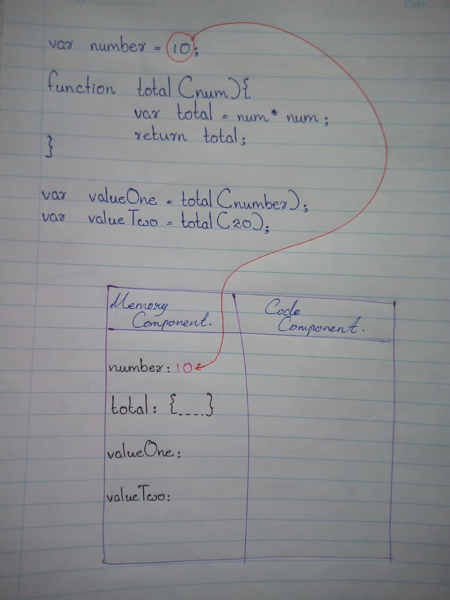
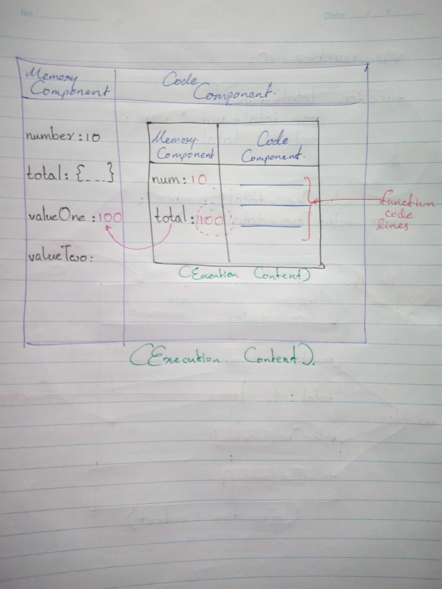
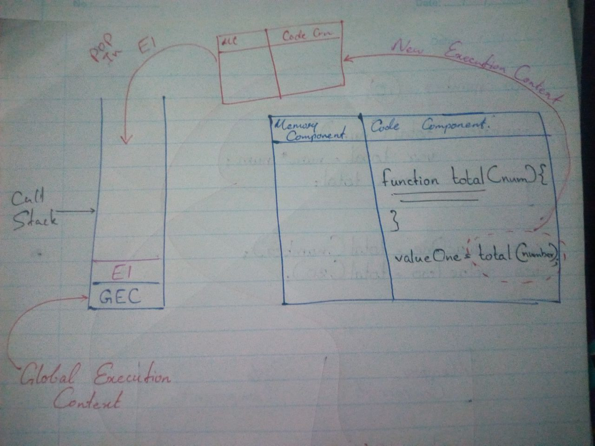

# How codes are executing inside of the execution context?

To understand, how the code lines are executing inside of the javascript execution context
we have to use a example code. Like this;

```
var number = 10;

function total(num) {
  var total = num * num;
  return total;
}

var valueOne = total(number);
var valueTwo = total(20);
```

We have learned that execution context has 2 phases, when we run a javascript code.
If we run this code now, JavaScript is creating a "Execution Context" and after that it'll follow that 2 phases what we learned before. Let's have a look on how is it doing that.

### Phase 1
Phase 1 is the "memory creation" phase. 

In this phase, javascript is allocating the variables and functions inside of that execution context's memory component side.

Remember, that variables and functions are storing as "key : value" pairs.

As I mentioned, now it'll check the code lines, one by one. Then if it see a variable or a function... then it's storing inside of that variable environment/memory component.

But, for now JavaScript is identifying that variables as "undefined" variables. However, functions are storing with their function code lines. Like this;


That's how the phase 1 is working. End of the phase 1, JavaScript controller entering to the phase 2.

### Phase 2

In here, JavaScript is checking the code lines again, one by one.

This time, it's assigning the absolute values of that variables. I mean, now it's replacing the undefined placeholders. 

We can see it with top variable, Like this;



But, in this time JavaScript controller isn't changing anythings inside of that functions. 'Cause, function initialization code lines are not calling the functions. So, controller is skipping that functions for now.

After that, controller is entering to the next variable. In our code example, we can see that "valueOne" variable's value is the output of "total" function.

When the JavaScript controller arrived their, it has to go for that function code lines. Why? Because, that variables are calling that function with passing arguments.

Now what? 

Now, JavaScript controller has to create a new "execution context" inside of current execution context. Using that execution context, the controller is gonna run that 2 phases again. 

We learned how that phase 1 is working. So, we have to remind it here. There are 2 new variables inside of this function code lines. They are "num"- function parameter, "total" variables.

As I mentioned before in the phase 1, controller is identify them as "undefined" variables. Like this;


After that, now the controller is starting the phase 2. Remember? In this phase 2, controller is execute that code lines one by one and storing absolute values to variables. 

In here we can see that "total" variable's value is equals to a calculation. That calculation is using the function caller's arguments. After the calculation it's value assigning to the "total" variable and in the next code line, that "total" variable is passing/returning to where the function called.

That means, that returning value is the new value of "valueOne" variable. Like this;


End of that, the JavaScript controller is deleting that mini execution context.


Now, we only have the main execution context. Now we can continue the next code line. Next code line is another variable and it's value is assigned to a function call's return value. That means, our previous steps are continuing again.

Now you can ask, if there are so many function calling statements inside of a function, then controller has to create so many execution context too... Isn't it a problem? 

Our execution context will show like this;

See, It's like a hell.

So, there is a thing we can use for this. It named "Call Stack".

With this call stack, we can maintain our execution order of execution contexts. How?
This call stack is saying, there is a main execution context inside of him and it named as "Global Execution Context". For now think that global execution context is at the bottom of the call stack.

That other function invoking things are happening inside of that, global execution context.

Actually, that call stack is a stack. Think you're running a JavaScript program. Then JavaScript controller is gonna use call stack for your program. It's doing all main things inside of that global execution context. And, when it come to another function calling, then it creates a new execution context. That execution context is pop into that call stack. Like this;


Then JavaScript controller can execute that execution context easily. End of that execution, the controller is pop out that execution context from the call stack. Like this;


Awesome...! Now we learned about "JavaScript Execution Context" and next we can learn "Hoisting".