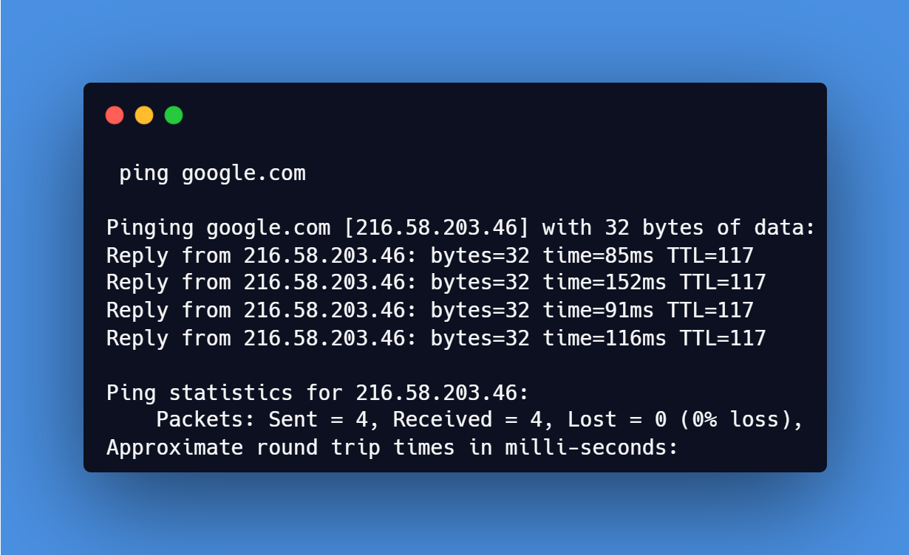
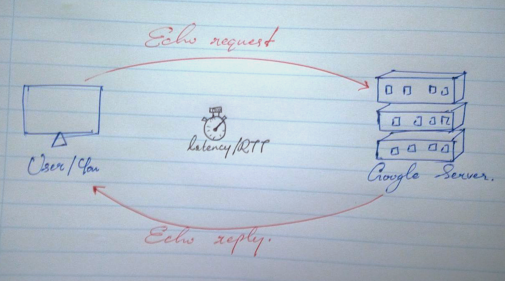

# Web Architecture Fundamentals

Let's have a look at my web domain:
https://www.kolitha.com

* `https:` <--- **Protocol**
* `www` <--- **Subdomain**
* `kolitha` <--- **Second Level Domain**
* `kolitha.com` <--- **Domain Name**
* `.com` <--- **TLD (Top-Level Domain)**

## What is an IP address?
* IP address is a unique numerical label assigned to each device on a network to identify and enable communication between devices.

Example:
`https://www.google.com` --> `216.58.203.14`

You can identify this process as **Resolving The Domain**. 

## Ports
### Common Ports:
* 80 -> insecure web (HTTP)
* 443 -> secure web (HTTPS)
* 25/587/465 --> Email
* 22 --> SSH (secure remote login)

### Port ranges from 0 - 65535
* 0 - 1023 for standard services (eg: 443 for secure web).
* 1024 - 49151 for databases and servers (eg: 3306 for MySql).
* (49152-65535) ephemeral/temporary

### Application protocols:
* HTTP/HTTPS
* FTP/SFTP - file transfer
* SMTP/IMAP - email

### TLS Take homes:
* Use valid certificates.
* Keep encryption setting up to date.
* Make sure users get directed to HTTPS.

### Status Code:
* 200 **OK**
* 301 **Permanent redirect**
* 404 **Not Found**
* 500 **Internal server error**

### Hosting Services:
Features provided by Hosting Services
* Domain registration.
* TLS/SSL certificate automation (so you can enable HTTPS easily).
* Monitoring tools (to check uptime and performance).
* Security features like firewalls, DDos protection, and backups.

___

# CLI Network Tools
### 1. Resolve DNS Records.

# Test Network Connectivity & DNS Resolution

* Protocol: Internet Control Message Protocol.
* ICMP is only for testing connectivity itself.
* We can't use it to request data or contents from web pages.

### Ping IP Address:
* Command all OS's : `ping <IP address>`
* Example : `ping 8.8.8.8` - google.com

If we use this command, it will send a echo request for servers & we are getting back an echo response.

### Ping a domain name:
* Command all OS's : `ping <Domain Name>`
* Example : `ping google.com`

Same theory in here too. You can send an echo request to the servers & can get echo response like ping Ip address.

Using these things we can Test: Connectivity, latency & DNS resolution.

### OS/Shell specific details:
Bash/Zsh;
* The process runs continuously until we stop it. (press ctrl + c to stop the process)
* Specify number of requests : `ping google.com -c <N>`

I tried that command `ping google.com` & then I got this output;

Let's break down into parts;

### 1. Head Start: 
`Pinging google.com [216.58.203.46] with 32 bytes of data:`
* DNS Resolution: 
in the command line you have entered the domain name as "google.com". It's a name and it's a human readable thing. But, computer can't understand that. Computer only know about numbers. So the computer is converting that `google.com` domain name into a number. We can introduce that number as an
**IP address**. Simply we can say our computer is converting that domain name `google.com` into it's ip address like this; 
**google.com** ---> **216.58.203.46**

* To this process, we are introducing as "**DNS Resolution**".

* `32 bytes`: This is the size of data packet. Yes, we are sending a data packet to do that test and this is the size of that data packet. You can see it's a small data packet.

### 2. The Replies:
`Reply from 216.58.203.46: bytes=32 time=85ms TTL=117`

* You can see that message 4 times on my output. Because, my computer sent it 4 times.

* Let's try to break down this lines one by one too;

    ■ **Reply from...** - This means we got a reply from the Google Server. That means, the connection is working perfectly.
    
    ■ **bytes=32** - The data size what we got as a reply. We sent 32 bytes. So this reply shows us we got 32 bytes too. That means, there is no data damage between the process.

    ■ **time=85ms (Millisecond)** - **This is the important part**. We can introduce this as the **latency**, otherwise we can say **Round Trip Time (RTT)**.  That means, your machine sending a signal to the server and that signal coming back to you computer/machine within 85 Milliseconds from 1000 Milliseconds.

    - Note: *If this value is getting to low, your connection is fast. Averagely 85ms means, decent speed. But, in the second line we can see 125ms. That means, I got a little lag.*

    ■ **TTL=117 (Time To Live)** - This is a technical one. Prevent packets from looping endlessly in the network. If this be zero(0) packet will drop. Using this count we can guess how many routers between the process (Hop Count).

### 3. The Statistics;
`Packets: Sent = 4, Received = 4, Lost = 0 (0% loss)`
* Sent = 4 : We sent 4 packets.
* Received = 4 : Google Server sent 4 answers for that all packets.
* Lost = 0 (0% loss) : This means, there was no loss between the process. That means, my connection is stable. Important thing is being 0%.

`Approximate round trip times in milli-seconds:`

* This shows the time latency.
* Using this we can check the average speed of the connection.

*Tip: If ping 8.8.8.8 works successfully, but ping google.com fails, it means your internet connection is active, but you have a **DNS resolution issue**.* 

